<div align="center">

<!-- Animated Header Banner -->


<!-- Typing SVG -->
<a href="https://git.io/typing-svg">
  
</a>

<br/>


&nbsp;

&nbsp;


</div>

---

<!-- About Me -->
<a href="https://github.com/iron-voldy">
  
</a>

### 🧬 `whoami`

```typescript
const hasindu = {
  name:        "Hasindu Theekshana",
  alias:       "iron-voldy 🧙",
  location:    "Sri Lanka 🇱🇰",
  role:        "Full Stack Developer",
  company:     "SysoftGroups",
  status:      "Open to Work 🟢",
  learning:    ["DevOps", "Cloud Architecture", "Rust"],
  askMeAbout:  ["Java", "Python", "PHP", "Node.js", "React"],
  email:       "hasindut1@gmail.com",
  portfolio:   "http://supun.traditionalme.life",
  funFact:     "I think I'm funny... my compiler disagrees 🤣",
  aiPowered:   true, // Claude + Codex + Antigravity + more ✨
};
```

<br/>

- 🔭 Currently working at **SysoftGroups**
- 🌱 Deep diving into **DevOps & Cloud Architecture**
- 💬 Ask me about **Java · Python · PHP · Node.js · React**
- 📫 Reach me → **hasindut1@gmail.com**
- 📄 My resume → **[View Experiences](http://supun.traditionalme.life/#resume)**
- ⚡ Fun fact: **I think I'm funny (unverified claim)**

<br clear="right"/>

---

## 🛸 Tech Universe

<div align="center">

### ⚙️ Backend
<p>
  
</p>

### 🎨 Frontend
<p>
  
</p>

### 🗄️ Database & Cloud
<p>
  
</p>

### 🔧 DevOps & Tools
<p>
  
</p>

</div>

---

## 📊 GitHub Analytics

<div align="center">


<br/>


</div>

---

## 👾 PAC-MAN Eating My Contributions

<picture>
  <source media="(prefers-color-scheme: dark)" srcset="dist/pacman-contribution-graph-dark.svg">
  <source media="(prefers-color-scheme: light)" srcset="dist/pacman-contribution-graph.svg">
  
</picture>

---

## 🎵 Currently Vibing On

<div align="center">

[](https://music.youtube.com)

> 🎧 *Coding mode: ON — headphones in, world out* 🔥

</div>

---

## 🌐 Connect With Me

<div align="center">

[](https://linkedin.com/in/YOUR_LINKEDIN)
[](https://instagram.com/iron_voldy)
[](https://fb.com/ironvoldy)
[](https://youtube.com/@YOUR_CHANNEL)
[](https://dev.to/YOUR_DEVTO)
[](mailto:hasindut1@gmail.com)
[](http://supun.traditionalme.life)

</div>

---

## 💭 Today's Dev Quote

<div align="center">
  
</div>

---

<div align="center">

### 💜 Thanks for stopping by! Drop a ⭐ if you vibe with my work!


</div>
